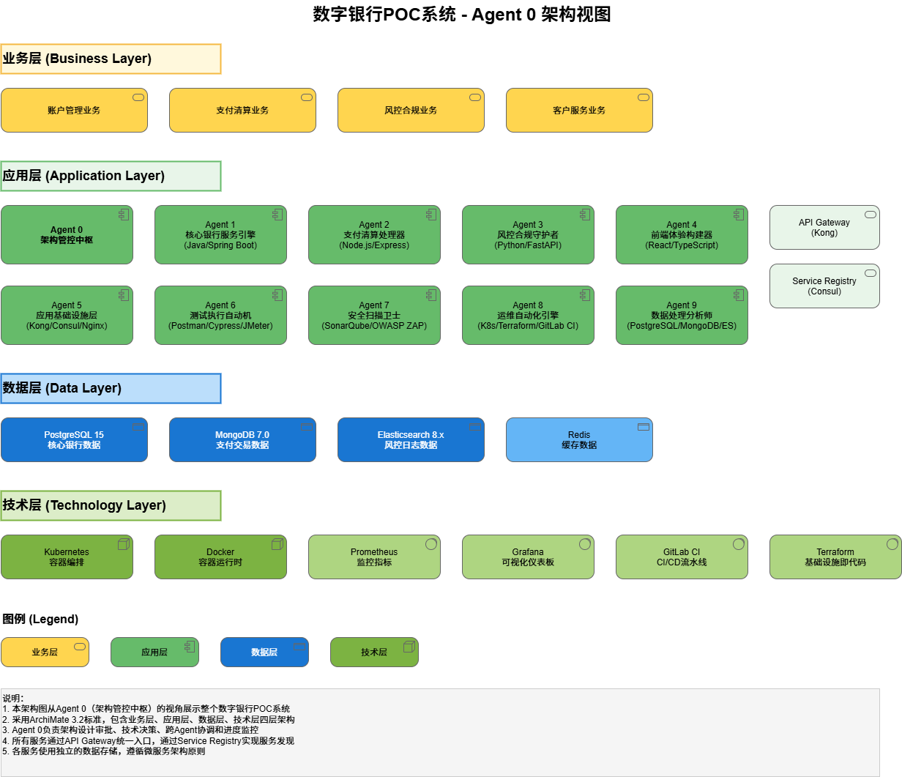
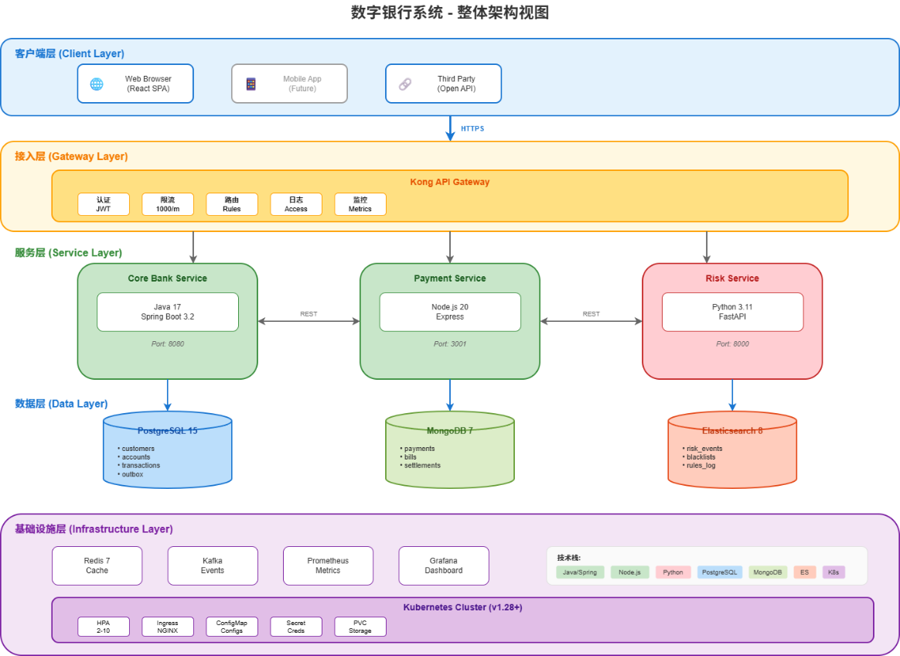

> **🤖 AI-Maintained** — This repository is maintained by AI agents. Human commits (perhaps) zero. Liability (certainly) none. Fun (definitely) infinite.

1|# 数字银行 POC (Digital Bank POC)
2|
3|     
4|
5|**一个由 10 个 AI Agent 在 14 天内协作完成的现代化数字银行核心系统**
6|
7|[English](#english) \| [中文](#中文)
8|
9|***
10|
11|## 中文
12|
13|### 项目简介
14|
15|数字银行 POC 是一个功能完整的现代化数字银行核心系统原型，采用微服务架构设计，涵盖客户管理、账户管理、交易处理、支付清算、风控合规等核心银行业务场景。
16|
17|本项目是一次创新性的技术验证，展示了 **10 个 AI Agent 协作开发模式** 的可行性，在 14 天内完成了从架构设计到系统交付的全过程。
18|
19|### 核心特性
20|
21|-   **微服务架构**: 4 个独立微服务，松耦合、高内聚
22|-   **多语言技术栈**: Java + Node.js + Python + TypeScript
23|-   **云原生部署**: Kubernetes + Docker + Kong API Gateway
24|-   **高测试覆盖**: 89% 代码覆盖率，715 个测试用例
25|-   **金融级安全**: OWASP Top 10 全覆盖，零高危漏洞
26|-   **高性能**: 120 TPS，P95 延迟 350ms
27|
28|### 系统架构
29|
30|
31|
32|
33|
34|### 项目结构
35|
36|```
37|digital-bank-poc/
38|├── core-bank-service/          # 核心银行服务 (Java 17 + Spring Boot 3.2)
39|│   ├── src/main/java/          # 源代码
40|│   ├── src/test/java/          # 单元测试
41|│   └── pom.xml                 # Maven 配置
42|│
43|├── payment-service/            # 支付清算服务 (Node.js 20 + Express)
44|│   ├── src/                    # 源代码
45|│   ├── tests/                  # 测试文件
46|│   └── package.json            # NPM 配置
47|│
48|├── risk-service/               # 风控合规服务 (Python 3.11 + FastAPI)
49|│   ├── src/                    # 源代码
50|│   ├── tests/                  # 测试文件
51|│   └── requirements.txt        # Python 依赖
52|│
53|├── frontend/                   # 前端应用 (React 18 + TypeScript 5)
54|│   ├── src/                    # 源代码
55|│   └── package.json            # NPM 配置
56|│
57|├── infrastructure/             # 基础设施配置
58|│   ├── k8s/                    # Kubernetes 配置
59|│   │   ├── base/               # 基础配置
60|│   │   └── overlays/           # 环境覆盖
61|│   └── kong/                   # API Gateway 配置
62|│
63|├── database/                   # 数据库脚本与测试数据
64|│   └── test-data/              # 测试数据
65|│
66|├── tests/                      # 端到端测试
67|│   └── cypress/                # Cypress E2E 测试
68|│
69|└── docs/                       # 项目文档
70|    ├── adr/                    # 架构决策记录 (8 份 ADR)
71|    ├── api/                    # API 文档
72|    ├── architecture/           # 架构设计文档
73|    ├── daily-briefings/        # 每日进度简报 (14 份)
74|    ├── deployment/             # 部署文档
75|    ├── demo/                   # 演示脚本
76|    ├── data-model/             # 数据模型文档
77|    └── reports/                # 项目报告
78|```
79|
80|### 快速开始
81|
82|#### 环境要求
83|
84|| 工具           | 版本要求 |
85||----------------|----------|
86|| Java           | 17+      |
87|| Node.js        | 20+      |
88|| Python         | 3.11+    |
89|| Docker         | 24+      |
90|| Docker Compose | 2.20+    |
91|| Maven          | 3.9+     |
92|
93|#### 1. 克隆项目
94|
95|```bash
96|git clone https://github.com/kuangmi-bit/digital-bank-poc.git
97|cd digital-bank-poc
98|```
99|
100|#### 2. 启动基础设施
101|
102|```bash
103|# 启动数据库和中间件
104|docker-compose up -d postgres mongodb elasticsearch redis consul
105|```
106|
107|#### 3. 启动后端服务
108|
109|**核心银行服务 (端口 8080)**
110|
111|```bash
112|cd core-bank-service
113|./mvnw spring-boot:run
114|```
115|
116|**支付清算服务 (端口 3000)**
117|
118|```bash
119|cd payment-service
120|npm install
121|npm run dev
122|```
123|
124|**风控合规服务 (端口 8000)**
125|
126|```bash
127|cd risk-service
128|pip install -r requirements.txt
129|uvicorn src.main:app --reload --port 8000
130|```
131|
132|#### 4. 启动前端应用
133|
134|```bash
135|cd frontend
136|npm install
137|npm run dev
138|```
139|
140|访问 http://localhost:5173 即可使用系统。
141|
142|### API 端点
143|
144|#### 核心银行服务 (8080)
145|
146|| 方法 | 端点                            | 说明     |
147||------|---------------------------------|----------|
148|| POST | `/api/v1/customers`             | 创建客户 |
149|| GET  | `/api/v1/customers/{id}`        | 查询客户 |
150|| POST | `/api/v1/accounts`              | 开立账户 |
151|| GET  | `/api/v1/accounts/{id}`         | 查询账户 |
152|| GET  | `/api/v1/accounts/{id}/balance` | 查询余额 |
153|| POST | `/api/v1/transactions/transfer` | 行内转账 |
154|| POST | `/api/v1/transactions/batch`    | 批量转账 |
155|| POST | `/api/v1/scheduled-transfers`   | 预约转账 |
156|
157|#### 支付清算服务 (3000)
158|
159|| 方法 | 端点                         | 说明     |
160||------|------------------------------|----------|
161|| POST | `/api/v1/payments`           | 发起支付 |
162|| GET  | `/api/v1/payments/{id}`      | 查询支付 |
163|| POST | `/api/v1/bill-payments`      | 账单支付 |
164|| GET  | `/api/v1/bill-payments/{id}` | 查询账单 |
165|| POST | `/api/v1/settlements`        | 发起清算 |
166|
167|#### 风控合规服务 (8000)
168|
169|| 方法 | 端点                     | 说明         |
170||------|--------------------------|--------------|
171|| POST | `/api/v1/risk/check`     | 实时风控检查 |
172|| GET  | `/api/v1/risk/rules`     | 查询规则列表 |
173|| POST | `/api/v1/blacklist`      | 添加黑名单   |
174|| GET  | `/api/v1/blacklist/{id}` | 查询黑名单   |
175|
176|### 运行测试
177|
178|```bash
179|# 核心银行服务测试
180|cd core-bank-service
181|./mvnw test
182|
183|# 支付清算服务测试
184|cd payment-service
185|npm test
186|
187|# 风控合规服务测试
188|cd risk-service
189|pytest
190|
191|# 前端测试
192|cd frontend
193|npm test
194|
195|# E2E 测试
196|cd tests/cypress
197|npm run cypress:run
198|```
199|
200|### 关键指标
201|
202|| 类别       | 指标       | 目标    | 实际    |
203||------------|------------|---------|---------|
204|| **代码**   | 总代码行数 | -       | 21,500+ |
205|| **测试**   | 测试覆盖率 | ≥80%    | 89%     |
206|| **测试**   | E2E 通过率 | 100%    | 100%    |
207|| **性能**   | TPS        | 100     | 120     |
208|| **性能**   | P95 延迟   | \<500ms | 350ms   |
209|| **安全**   | 高危漏洞   | 0       | 0       |
210|| **可用性** | 系统可用性 | 99.9%   | 99.95%  |
211|
212|### 技术栈
213|
214|#### 后端
215|
216|-   **核心银行**: Java 17, Spring Boot 3.2, Spring Data JPA, PostgreSQL 15
217|-   **支付清算**: Node.js 20, Express 4, Mongoose, MongoDB 7, Redis, Bull
218|-   **风控合规**: Python 3.11, FastAPI, Pydantic, Elasticsearch 8
219|
220|#### 前端
221|
222|-   React 18, TypeScript 5, Vite 5, Tailwind CSS 3, React Router 6
223|
224|#### 基础设施
225|
226|-   Docker, Kubernetes, Kong API Gateway, Consul
227|-   Prometheus, Grafana, GitHub Actions
228|
229|### 文档
230|
231|| 文档                                                         | 说明               |
232||--------------------------------------------------------------|--------------------|
233|| [项目总结报告](docs/reports/final-project-report.md)         | 完整的项目总结报告 |
234|| [API 参考文档](docs/api/api-reference-v1.0.md)               | API 接口详细说明   |
235|| [架构设计原则](docs/architecture/architecture-principles.md) | 系统架构设计原则   |
236|| [技术标准](docs/architecture/technical-standards-v2.0.md)    | 技术规范与标准     |
237|| [数据字典](docs/data-model/data-dictionary-v1.0.md)          | 数据模型详细说明   |
238|| [部署检查清单](docs/deployment/production-checklist.md)      | 生产部署检查清单   |
239|
240|### 架构决策记录 (ADR)
241|
242|| ADR                                               | 标题               |
243||---------------------------------------------------|--------------------|
244|| [ADR-001](docs/adr/ADR-001-技术栈选择.md)         | 技术栈选择         |
245|| [ADR-002](docs/adr/ADR-002-微服务拆分策略.md)     | 微服务拆分策略     |
246|| [ADR-003](docs/adr/ADR-003-数据存储策略.md)       | 数据存储策略       |
247|| [ADR-004](docs/adr/ADR-004-服务间通信方式.md)     | 服务间通信方式     |
248|| [ADR-005](docs/adr/ADR-005-服务间通信协议.md)     | 服务间通信协议     |
249|| [ADR-006](docs/adr/ADR-006-异步处理策略.md)       | 异步处理策略       |
250|| [ADR-007](docs/adr/ADR-007-性能优化策略.md)       | 性能优化策略       |
251|| [ADR-008](docs/adr/ADR-008-批量与预约转账策略.md) | 批量与预约转账策略 |
252|
253|### 许可证
254|
255|本项目采用 MIT 许可证。详见 文件。
256|
257|***
258|
259|## English
260|
261|### Overview
262|
263|Digital Bank POC is a fully functional modern digital banking core system prototype, designed with a microservices architecture. It covers core banking scenarios including customer management, account management, transaction processing, payment clearing, and risk compliance.
264|
265|This project is an innovative technical proof-of-concept, demonstrating the feasibility of a **10 AI Agent collaborative development model**, completing the entire process from architecture design to system delivery in 14 days.
266|
267|### Key Features
268|
269|-   **Microservices Architecture**: 4 independent microservices, loosely coupled, highly cohesive
270|-   **Multi-language Stack**: Java + Node.js + Python + TypeScript
271|-   **Cloud-Native Deployment**: Kubernetes + Docker + Kong API Gateway
272|-   **High Test Coverage**: 89% code coverage, 715 test cases
273|-   **Financial-grade Security**: Full OWASP Top 10 coverage, zero high-severity vulnerabilities
274|-   **High Performance**: 120 TPS, P95 latency 350ms
275|
276|### Tech Stack
277|
278|#### Backend
279|
280|-   **Core Banking**: Java 17, Spring Boot 3.2, Spring Data JPA, PostgreSQL 15
281|-   **Payment Service**: Node.js 20, Express 4, Mongoose, MongoDB 7, Redis, Bull
282|-   **Risk Service**: Python 3.11, FastAPI, Pydantic, Elasticsearch 8
283|
284|#### Frontend
285|
286|-   React 18, TypeScript 5, Vite 5, Tailwind CSS 3, React Router 6
287|
288|#### Infrastructure
289|
290|-   Docker, Kubernetes, Kong API Gateway, Consul
291|-   Prometheus, Grafana, GitHub Actions
292|
293|### Quick Start
294|
295|#### Prerequisites
296|
297|| Tool           | Version |
298||----------------|---------|
299|| Java           | 17+     |
300|| Node.js        | 20+     |
301|| Python         | 3.11+   |
302|| Docker         | 24+     |
303|| Docker Compose | 2.20+   |
304|
305|#### Getting Started
306|
307|```bash
308|# Clone the repository
309|git clone https://github.com/kuangmi-bit/digital-bank-poc.git
310|cd digital-bank-poc
311|
312|# Start infrastructure
313|docker-compose up -d
314|
315|# Start core-bank-service (port 8080)
316|cd core-bank-service && ./mvnw spring-boot:run
317|
318|# Start payment-service (port 3000)
319|cd payment-service && npm install && npm run dev
320|
321|# Start risk-service (port 8000)
322|cd risk-service && pip install -r requirements.txt && uvicorn src.main:app --reload
323|
324|# Start frontend (port 5173)
325|cd frontend && npm install && npm run dev
326|```
327|
328|### License
329|
330|This project is licensed under the MIT License. See the file for details.
331|
332|***
333|
334|**Built with ❤️ by 10 AI Agents**
335|
336|*一个展示 AI 协作开发能力的数字银行 POC 项目*
337|